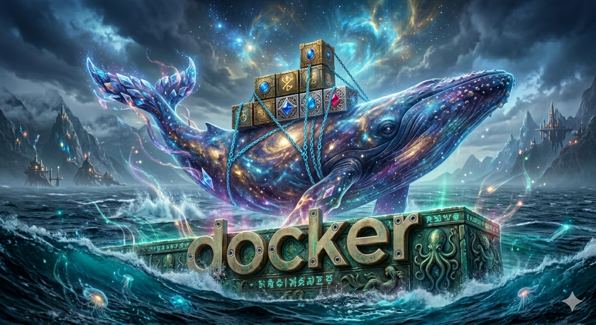

## Contenedor de Tutorial de Docker

docker pull docker/getting-started

docker run -d -p 80:80 docker/getting-started

- -d detach (El proceso del contenedor se ejuecuta en background)
- -p (port, publish) (Mapea el puerto)
- docker/getting-started (Nombre de la imagen)

## Contenedor del DBMS MariaBD
docker pull mariadb

## Comandos Docker
| Comando | Descripción |
| :--- | :--- |
| docker pull nombre_imagen | **Descarga una imagen de DockerHub** [Docker Hub](https://hub.docker.com/) |
| docker images | **Visualizar las imagenes que se encuentran en el docker** |